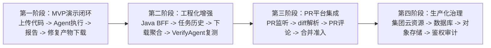
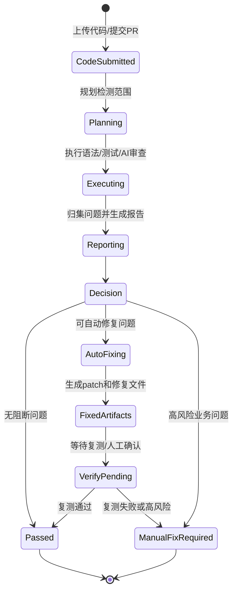

# PRD 技术落地与 MVP 裁剪建议

版本日期：2026-07-14  
关联 PRD：代码 PR 审查闭环自动化测试智能体  
关联实现：`src/tcr_agent/graph.py`、`src/tcr_agent/api.py`

## 1. 总体判断

产品同事的 PRD 方向是成立的，核心价值可以概括为：

```text
在代码合并前，通过智能体完成检测规划、自动执行、问题分析、修复建议或自动修复，降低人工审查成本并前置拦截缺陷。
```

但当前 PRD 是偏完整产品形态的描述，范围包含：

- PR 监听与合并权限控制。
- 多维度代码合规扫描。
- 业务功能正确性判断。
- 检测规则自适应更新。
- 自动修复。
- 自动复测闭环。
- 企业级部署、权限、存储和审计。

这些能力不适合一次性全部作为 MVP 交付。建议将 PRD 拆成三期：

```text
MVP 演示闭环 -> 工程化增强 -> PR 平台集成与生产化
```

## 2. 当前实现与 PRD 对齐关系

当前代码已经完成的 Agent 链路：

```text
LLMTestGenerationAgent
  -> TestAgent
  -> ReportAgent
  -> FixAgent
```

当前 FastAPI 已提供：

```http
POST /runs
GET  /runs/{run_id}
GET  /runs/{run_id}/report
GET  /runs/{run_id}/diff.patch
GET  /runs/{run_id}/fixed-files
GET  /runs/{run_id}/artifacts/{name}
```

### 2.1 已覆盖能力

| PRD 能力 | 当前实现情况 | 说明 |
|---|---|---|
| 代码上传 / 输入 | 已实现 | FastAPI `POST /runs` 支持上传 `.py` 文件。 |
| 自动执行检测 | 已实现 | `TestAgent` 执行测试、`py_compile`、可选 AI 代码审查。 |
| 语法基础检查 | 已实现 | 通过 `py_compile` 完成基础语法检查。 |
| LLM 自主生成测试 | 已实现一版 | 无用户测试时可由 `LLMTestGenerationAgent` 生成 pytest 测试。 |
| 问题归集 | 已实现 | `ReportAgent` 将测试失败、合规问题、AI 审查问题归集为 `issues`。 |
| 根因和建议 | 已实现一版 | `ReportAgent` 可使用 LLM 生成摘要、根因、修复建议。 |
| 自动修复 | 已实现一版 | `FixAgent` 可修复临时沙箱代码并生成 patch。 |
| 修复产物输出 | 已实现底层能力 | 支持 `diff.patch` 和 `fixed-files`，缺少一键 `/download`。 |

### 2.2 部分覆盖能力

| PRD 能力 | 当前差距 | 建议 |
|---|---|---|
| 代码合规性审查 | 当前主要是 `py_compile` 和 LLM review，`ruff/semgrep` 仅预留 | MVP 先用 AI review 表达合规审查，后续接入 ruff/semgrep。 |
| 功能实现正确性审查 | 当前依赖用户测试、LLM 生成测试、LLM review | MVP 表述为“基于需求说明和测试推断的功能风险识别”。 |
| 自主规划审查维度 | 当前由固定配置驱动 | MVP 表述为“根据是否存在测试、是否启用 AI review 自动选择检测路径”。 |
| 自愈整改 | 当前只修复沙箱文件，不覆盖原仓库 | MVP 表述为“生成修复文件与 patch，供人工确认下载”。 |
| 自动复测 | 当前 README 明确未实现 `VerifyAgent` | 作为第二阶段增强。 |

### 2.3 尚未覆盖能力

| PRD 能力 | 当前状态 | 建议阶段 |
|---|---|---|
| PR 事件监听 | 未实现 | 第三阶段，与 Git 平台集成。 |
| PR diff 范围解析 | 未实现 | 第二或第三阶段。 |
| 自动拦截合并权限 | 未实现 | 第三阶段，需要 Git 平台权限。 |
| 检测规则自愈 | 未实现 | 第三阶段，难度较高。 |
| 自动更新测试规则 | 未实现 | 第三阶段。 |
| 企业级云服务部署 | 未实现 | 生产化阶段，需要集团资源。 |
| 数据库存储 | 未实现 | Java 本地 MVP 可先用内存/H2/SQLite。 |
| 多语言支持 | 未实现 | 当前主要支持 Python。 |

## 3. 推荐 MVP 定义

MVP 不建议直接叫“PR 全自动审查平台”，建议先定义为：

```text
面向 PR 代码审查场景的 TCR Agent 演示系统。
```

MVP 目标：

```text
用户上传待审查代码文件和需求说明后，系统自动执行语法检查、测试执行、AI 审查、报告生成和沙箱修复，前端展示报告并支持下载修复产物。
```

### 3.1 MVP 必做能力

- 上传 `.py` 源码文件。
- 可选上传测试文件。
- 可填写需求说明。
- 创建异步 Agent 任务。
- 轮询任务状态。
- 展示检测报告。
- 展示问题列表、风险等级、根因和建议。
- 生成 patch。
- 获取修复后文件内容。
- 支持下载修复后代码或 patch。

### 3.2 MVP 不承诺能力

- 不承诺自动监听真实 Git PR。
- 不承诺自动阻断合并。
- 不承诺覆盖所有代码规范。
- 不承诺真实生产环境部署。
- 不承诺多语言。
- 不承诺完全无人值守修复业务逻辑问题。
- 不承诺自愈后自动复测闭环。

这些不代表不做，而是放在后续阶段。

## 4. PRD 表述建议

产品文档可以保留大方向，但建议增加“阶段边界”。

### 4.1 当前 MVP 表述

建议这样描述：

```text
第一阶段聚焦 TCR Agent 核心闭环能力验证，不直接接入真实 PR 平台。
用户通过前端上传代码文件和需求说明，系统自动完成测试生成、语法检查、AI 代码审查、报告生成与沙箱修复，输出结构化报告、patch 和修复后文件。
```

### 4.2 第二阶段表述

```text
第二阶段引入 Java BFF 和任务管理能力，补齐任务历史、下载聚合、错误治理、文件归档、接口 DTO 稳定化，并补充 VerifyAgent 自动复测能力。
```

### 4.3 第三阶段表述

```text
第三阶段接入真实代码托管平台，监听 PR 事件，解析增量 diff，根据审查结果回写 PR 评论、状态检查和合并准入结果，并逐步接入 ruff、semgrep 等规则引擎。
```

## 5. 三阶段路线图



## 6. 建议系统边界

### 6.1 FastAPI Agent 负责

- Agent 编排。
- 代码测试与检查。
- LLM 测试生成。
- AI 代码审查。
- 报告生成。
- 沙箱修复。
- 输出 `result.json`、`fix.patch`、`fixed_files`。

### 6.2 Java 后端负责

- 前端统一接口。
- 本地任务记录。
- 文件上传校验。
- 任务状态聚合。
- 报告 DTO 转换。
- 下载聚合，单文件或 zip。
- 后续鉴权、审计、持久化、网关接入。

### 6.3 前端负责

- 文件上传。
- 需求说明输入。
- 任务进度展示。
- 报告展示。
- 问题列表展示。
- 下载按钮。

## 7. 结合 PRD 的状态流转



MVP 当前状态：

- `Planning` 由固定配置和 LLM 测试生成承担。
- `Executing` 已由 `TestAgent` 承担。
- `Reporting` 已由 `ReportAgent` 承担。
- `AutoFixing` 已由 `FixAgent` 承担。
- `VerifyPending -> Passed` 还需要后续 `VerifyAgent`。

## 8. 风险点与降级策略

| 风险点 | 影响 | 降级策略 |
|---|---|---|
| 集团云资源申请卡住 | Java 正式部署与数据库落库延期 | 先本地 Java BFF + FastAPI 内网联调。 |
| 前端同事时间不足 | 页面接入慢 | FastAPI `/docs` 和 Java DTO 先用于接口测试；页面只做最小上传和轮询。 |
| PR 监听权限不足 | 无法接真实代码平台 | 第一阶段改为手动上传文件模拟 PR。 |
| 数据库空间未申请 | 无法持久化任务 | Java 先用内存 Map、H2、SQLite 或 JSON 文件。 |
| 下载接口未闭环 | 前端无法一键下载 | 短期用 `/fixed-files` 或 `/diff.patch`；后续补 `/download`。 |
| 自动修复不稳定 | 修复结果可能不可信 | MVP 定位为“沙箱修复建议”，不自动覆盖原代码。 |

## 9. 组会建议说法

可以这样说：

```text
产品 PRD 定义的是完整形态，我们建议分阶段落地。

第一阶段先验证 TCR Agent 核心闭环：上传代码、自动检测、生成报告、输出修复产物。这个阶段不依赖集团云资源，也不强依赖真实 PR 平台，用本地或内网服务即可完成联调。

第二阶段引入 Java BFF，承担任务管理、文件下载、前端 DTO 和本地任务记录，让后端同学形成稳定交付。

第三阶段再接入真实 PR 平台和企业资源，实现 PR 监听、评论回写、合并准入和生产化治理。

这样既不削弱 PRD 的产品愿景，也能避免 MVP 被云资源、数据库权限和平台集成权限卡住。
```

## 10. 当前最优下一步

建议立刻做三件事：

1. FastAPI Agent 暴露内网测试地址，供同事调试当前接口。
2. Java 同事基于当前接口文档实现本地 BFF，不依赖数据库和集团云空间。
3. 前端同事基于 Demo 分支接入最小流程：上传、轮询、展示报告、下载 patch 或修复文件。

当前阶段的核心验收标准：

```text
不用真实 PR 平台，也不用集团云资源，先跑通“代码输入 -> 检测报告 -> 修复产物”的演示闭环。
```

