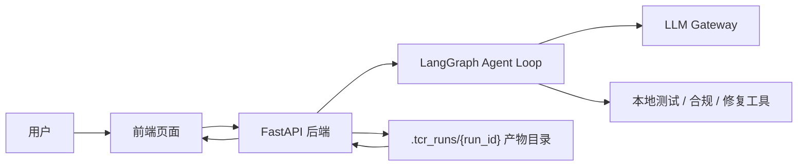
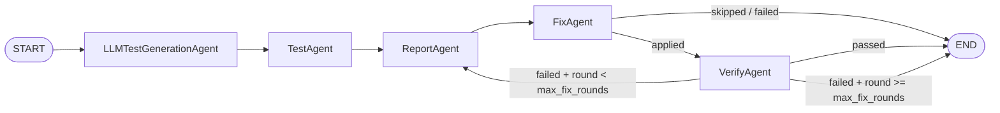
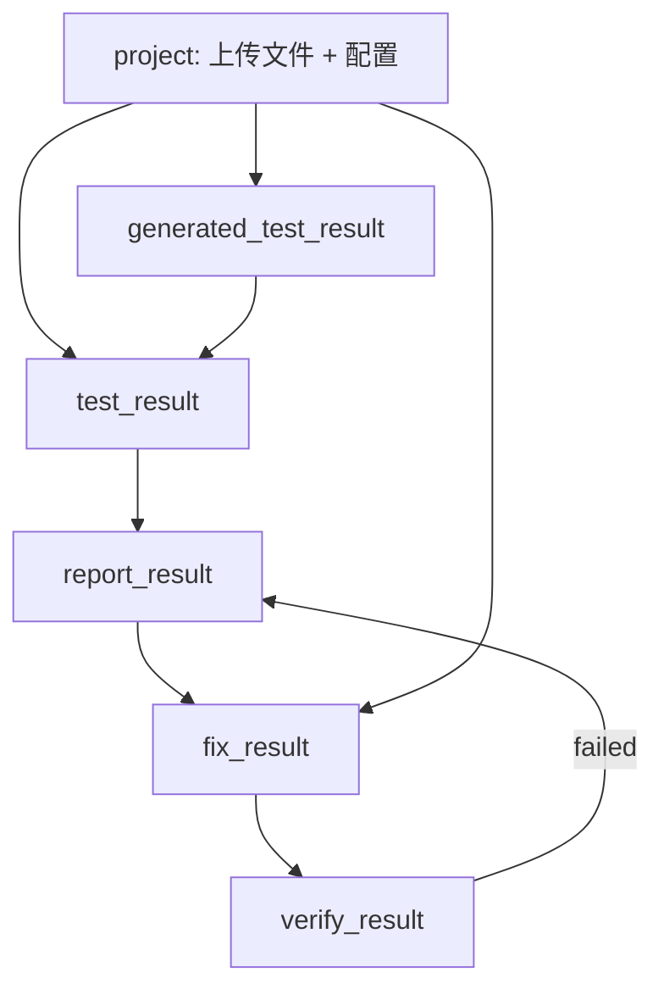
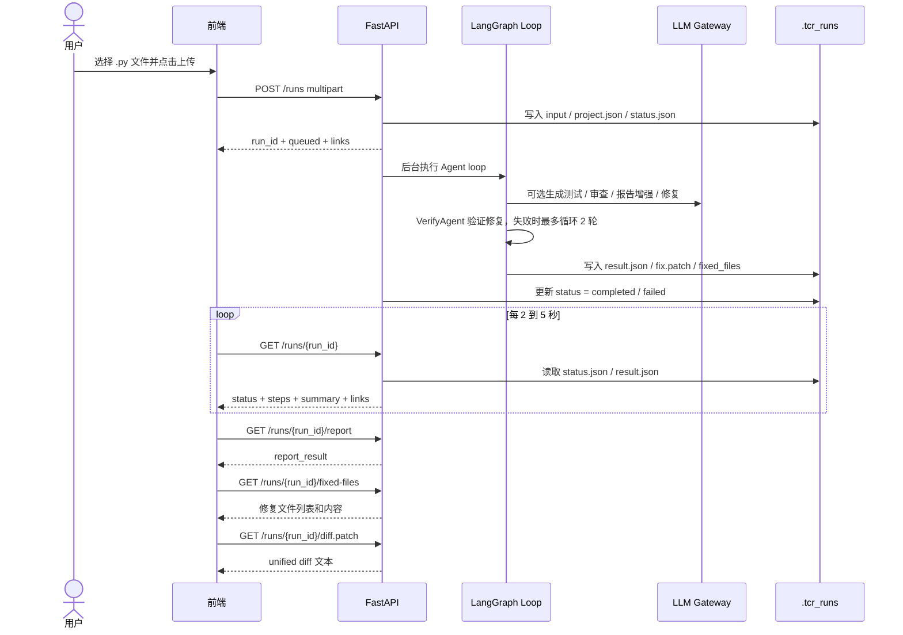
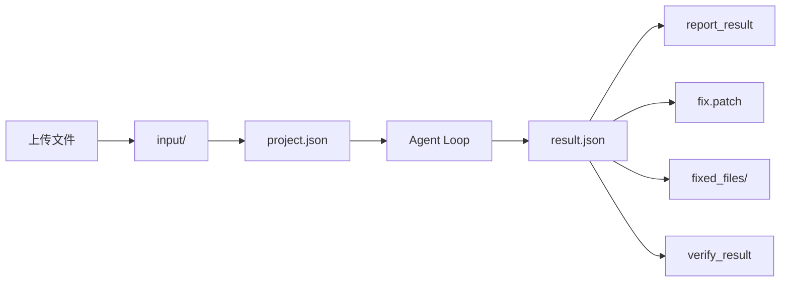

# TCR Agent 项目技术方案

## 1. 项目目标

TCR Agent 是一个面向代码测试、合规检查、报告生成和自动修复的 Agent 原型系统。

当前 MVP 阶段目标：

- 前端提供上传、处理中、结果展示三个页面。
- 后端使用 FastAPI 包装 Agent 能力，前端直接调用 FastAPI。
- Agent 使用 LangGraph 编排多个节点，形成可追踪的有条件修复验证闭环。
- 系统输出结构化报告、Issue 列表、修复 patch 和修复后文件。

整体链路：

```txt
上传代码文件 -> 创建任务 -> Agent loop 执行 -> 生成报告 -> 修复并验证 -> 前端展示
```

## 2. 技术栈

### 2.1 后端技术

| 技术 | 用途 |
|---|---|
| Python 3.11+ | 后端和 Agent 主语言 |
| FastAPI | 对外提供 HTTP API |
| Uvicorn | FastAPI ASGI 服务启动 |
| python-multipart | 支持 multipart 文件上传 |
| LangGraph | 编排 Agent 条件循环图 |
| pytest / unittest | 执行 Python 测试 |
| py_compile | Python 语法和基础合规检查 |
| OpenAI-compatible Chat Completions | 对接 DeepSeek 或公司内部大模型网关 |

### 2.2 前端技术

前端技术栈由前端同事最终确定，当前后端对接只要求：

- 支持 `multipart/form-data` 上传文件。
- 支持轮询 HTTP 接口。
- 支持展示 JSON 报告、Issue 列表、文本 patch 和修复文件内容。

建议前端封装：

- `taskApi.ts`：统一封装后端请求。
- `useTaskPolling.ts`：统一封装任务轮询。
- `UploadPage` / `ProcessingPage` / `ResultPage`：三个页面按流程拆分。

## 3. 总体架构

当前 MVP 阶段不再引入 Java BFF，前端直接调用 FastAPI。



### 3.1 前端职责

- 上传 `.py` 文件。
- 轮询任务状态。
- 展示 loading、处理阶段和失败信息。
- 展示报告摘要、Issue 列表、Repair 文件、patch diff。
- 调用下载或预览接口。

### 3.2 FastAPI 后端职责

- 接收前端上传的 Python 文件。
- 创建异步任务并返回 `run_id`。
- 调用 LangGraph 执行 Agent 链路。
- 保存任务状态和执行产物。
- 提供状态查询、报告查询、patch 查询、修复文件查询接口。

### 3.3 Agent Loop 职责

- 生成测试。
- 执行测试和合规检查。
- 汇总 Issue 并生成报告。
- 基于报告尝试自动修复。
- 对修复后的 workspace 重新测试和合规验证。
- 验证失败且未超过轮次上限时，再次生成报告并修复。

## 4. Graph 条件循环说明

项目中的 Graph 指的是 LangGraph 编排的 Agent 执行图。当前已经从线性 DAG 升级为有上限的条件循环图，也就是 bounded agent loop。

Loop 的含义：

- 有向：每个节点之间有明确执行方向。
- 有条件回边：验证失败时可以从 `VerifyAgent` 回到 `ReportAgent`。
- 有上限：默认最多修复验证 `2` 轮，避免无限循环。
- 可追踪：每个节点输出会写入统一的 `GraphState`，后续节点基于上游结果继续处理。

当前代码位置：

```txt
src/tcr_agent/graph.py
```

当前 Graph：



### 4.1 节点说明

| 节点 | 输入 | 输出 | 说明 |
|---|---|---|---|
| `LLMTestGenerationAgent` | 用户代码、需求说明 | `generated_test_result` | 没有用户测试时，可选调用 LLM 生成 pytest 测试 |
| `TestAgent` | 用户代码、生成测试 | `test_result` | 执行 pytest / unittest、py_compile、AI 代码审查 |
| `ReportAgent` | 测试结果、合规结果 | `report_result` | 汇总 Issue、风险等级、根因和修复建议 |
| `FixAgent` | 报告 Issue、源码 | `fix_result` | 调用 LLM 生成修复内容，输出 patch 和修复文件 |
| `VerifyAgent` | 修复后的 workspace | `verify_result` | 重新执行确定性测试和 py_compile，判断修复是否通过 |

### 4.2 GraphState 数据流

每个 Agent 节点通过同一个状态对象传递数据：

```ts
{
  run_id: string;
  project: object;
  generated_test_result?: object;
  test_result?: object;
  report_result?: object;
  fix_result?: object;
  verify_result?: object;
  fix_round?: number;
  max_fix_rounds?: number;
  test_history?: object[];
  report_history?: object[];
  fix_history?: object[];
  verify_history?: object[];
  errors?: string[];
}
```

节点之间的数据依赖：



## 5. 前后端交互数据流

### 5.1 页面流程

```mermaid
flowchart TD
    Upload["上传页 /upload"] -->|POST /runs| Created["后端返回 run_id"]
    Created --> Processing["处理中页 /processing/:taskId"]
    Processing -->|GET /runs/{run_id} 轮询| Status{"任务状态"}
    Status -->|queued / running| Processing
    Status -->|completed| Result["结果页 /result/:taskId"]
    Status -->|failed| Error["失败提示"]
    Result -->|GET /runs/{run_id}/report| Report["报告 + Issue"]
    Result -->|GET /runs/{run_id}/fixed-files| Repair["Repair 文件"]
    Result -->|GET /runs/{run_id}/diff.patch| Patch["Patch diff"]
    Result --> VerifyView["验证结果 / 修复轮次"]
```

说明：

- 前端路由中的 `taskId` 实际就是 FastAPI 返回的 `run_id`。
- 处理中页刷新后，可以继续使用 URL 中的 `taskId` 轮询。
- 结果页只在任务 `completed` 后请求报告和修复文件。

### 5.2 时序图



## 6. 后端接口设计

FastAPI 默认地址：

```txt
http://127.0.0.1:8010
```

### 6.1 创建任务

```http
POST /runs
Content-Type: multipart/form-data
```

请求字段：

| 字段 | 类型 | 必填 | 说明 |
|---|---:|---:|---|
| `files` | file[] | 是 | 一个或多个 `.py` 文件 |
| `requirement` | string | 否 | 需求说明 |
| `ai_review` | boolean | 否 | 是否启用 AI 审查 |
| `llm_generate_tests` | boolean | 否 | 是否允许 LLM 生成测试 |
| `report_use_llm` | boolean | 否 | 报告是否使用 LLM 增强 |
| `auto_fix` | boolean | 否 | 是否自动修复 |
| `fix_target_severities` | string | 否 | 自动修复的问题级别 |

返回：

```json
{
  "run_id": "run_1720840000_ab12cd34",
  "status": "queued",
  "links": {
    "self": "/runs/run_1720840000_ab12cd34",
    "report": "/runs/run_1720840000_ab12cd34/report",
    "patch": "/runs/run_1720840000_ab12cd34/diff.patch",
    "fixed_files": "/runs/run_1720840000_ab12cd34/fixed-files"
  }
}
```

### 6.2 查询任务状态

```http
GET /runs/{run_id}
```

返回：

```json
{
  "run_id": "run_1720840000_ab12cd34",
  "status": "running",
    "steps": [
    {"agent": "LLMTestGenerationAgent", "status": "pending"},
    {"agent": "TestAgent", "status": "pending"},
    {"agent": "ReportAgent", "status": "pending"},
    {"agent": "FixAgent", "status": "pending"},
    {"agent": "VerifyAgent", "status": "pending"}
  ],
  "summary": "",
  "result": null,
  "links": {}
}
```

任务状态：

| 状态 | 含义 | 前端处理 |
|---|---|---|
| `queued` | 任务已创建，等待执行 | 继续轮询 |
| `running` | Agent 正在执行 | 展示 loading，继续轮询 |
| `completed` | 任务完成 | 跳转结果页 |
| `failed` | 任务失败 | 停止轮询，展示错误 |

### 6.3 获取报告

```http
GET /runs/{run_id}/report
```

返回 `report_result`，包含：

- `summary`
- `issues`
- `risk_level`
- `should_fix`
- `llm_used`
- `warnings`

任务完整结果中还会包含：

- `verify_result`
- `verify_history`
- `fix_round`
- `max_fix_rounds`

### 6.4 获取修复文件

```http
GET /runs/{run_id}/fixed-files
```

返回：

```json
{
  "files": [
    {
      "path": "order_pricing.py",
      "content": "def fixed():\n    return True\n"
    }
  ]
}
```

### 6.5 获取 patch

```http
GET /runs/{run_id}/diff.patch
```

返回 unified diff 文本。

### 6.6 下载指定产物

```http
GET /runs/{run_id}/artifacts/{name}
```

可用于下载：

- `fix.patch`
- 修复后的指定文件

## 7. 数据与产物存储

每次任务会生成一个运行目录：

```txt
.tcr_runs/{run_id}/
```

主要文件：

| 文件 / 目录 | 说明 |
|---|---|
| `input/` | 用户上传的原始文件 |
| `project.json` | 本次任务输入和配置 |
| `status.json` | 任务状态 |
| `result.json` | Graph 完整执行结果，包含验证结果和历史 |
| `fix.patch` | 合并后的修复 diff |
| `fixed_files/` | 修复后的文件 |

数据流向：



## 8. 安全与隔离

当前 MVP 的安全策略：

- 只接受 `.py` 文件。
- 上传文件必须是 UTF-8 文本。
- 禁止绝对路径和 `..` 路径。
- 重复文件名会被拒绝。
- FixAgent 只在临时沙箱中应用修改，不覆盖用户原始文件。
- VerifyAgent 验证前会清理修复 workspace 中的 Python bytecode 缓存，避免命中旧 `__pycache__`。
- 修复产物复制到 `.tcr_runs/{run_id}/fixed_files/` 供前端查看。

当前限制：

- FastAPI 暂未配置鉴权。
- FastAPI 暂未内置 CORS。
- 后端任务使用进程内 `BackgroundTasks`，不适合高并发长任务。
- 任务产物保存在本地磁盘，多实例部署需要共享存储或固定路由。

## 9. 部署和启动

启动 FastAPI：

```bash
.venv/bin/python -m uvicorn tcr_agent.api:app --host 127.0.0.1 --port 8010
```

前端开发时，如果和 FastAPI 不同端口，建议配置 dev server proxy：

```txt
/runs -> http://127.0.0.1:8010/runs
```

LLM 网关通过环境变量配置：

```txt
LLM_GATEWAY_BASE_URL
LLM_GATEWAY_API_KEY
LLM_GATEWAY_MODEL
LLM_GATEWAY_TIMEOUT_SECONDS
LLM_GATEWAY_AUTH_HEADER
LLM_GATEWAY_VERIFY_SSL
LLM_GATEWAY_EXTRA_HEADERS_JSON
```

## 10. 当前 MVP 范围

已覆盖：

- 文件上传。
- 异步任务创建。
- 状态轮询。
- LangGraph Agent loop 执行。
- 测试生成、测试执行、报告生成、自动修复。
- 修复后验证，失败时按轮次上限再次报告和修复。
- 报告和 Issue 查询。
- patch 查询。
- 修复文件预览。

暂不覆盖：

- 用户登录和鉴权。
- 任务历史列表。
- 一键 zip 下载。
- WebSocket / SSE 流式输出。
- 分布式任务队列。
- 多实例共享存储。

## 11. 后续扩展建议

短期：

- FastAPI 增加 CORS 配置。
- 增加 `GET /runs/{run_id}/download`，支持单文件和 zip 下载。
- 前端补充 patch diff 预览。
- 结果页增强 Issue 和 Repair 文件关联展示。

中期：

- 引入 SSE / WebSocket，替代轮询，展示 Agent 流式状态。
- 接入任务历史和简单用户标识。
- 增加任务过期清理机制。
- 接入 ruff、semgrep 等规则引擎。

长期：

- 引入独立任务队列。
- 产物迁移到对象存储。
- 接入代码托管平台 PR 审查。
- 支持更多语言和多 Agent 分支流程。
