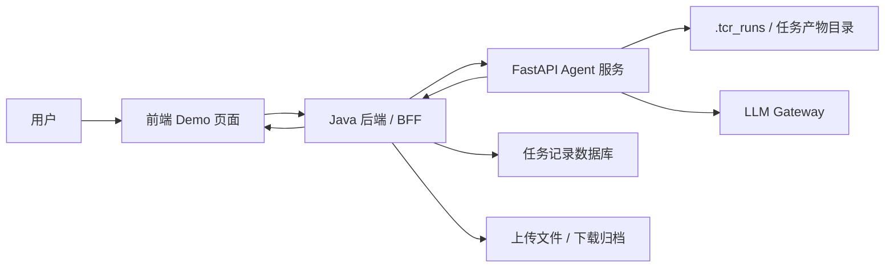
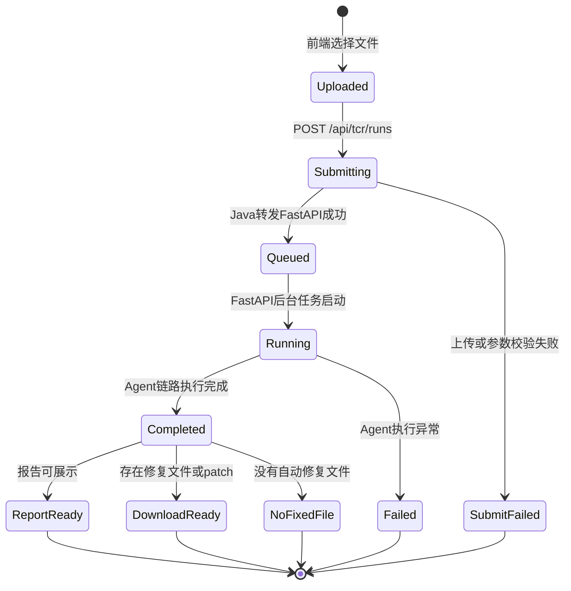
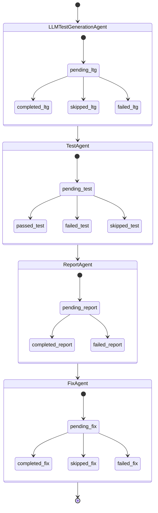
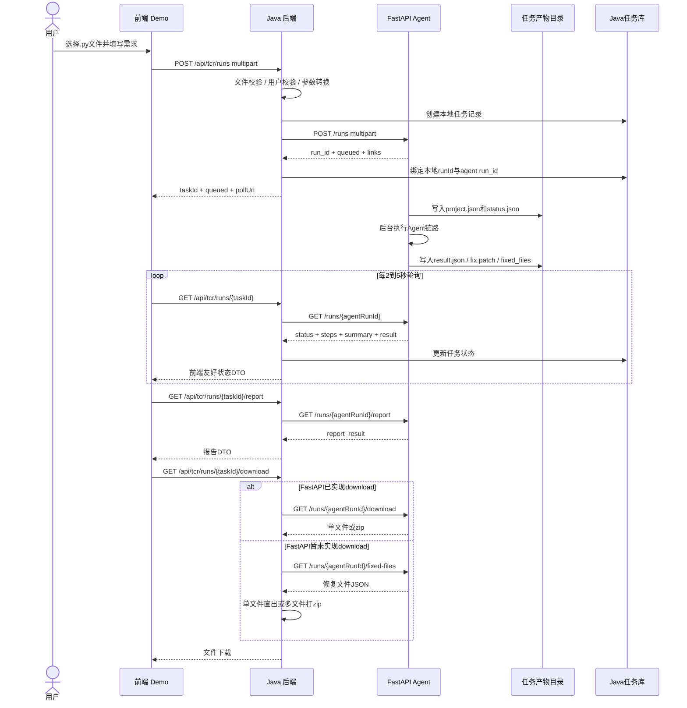

# TCR Agent 项目协作与对接方案拟定稿

> 2026-07-14 更新：由于 Java 后端暂时不搭建，本文中的 Java / BFF 方案仅作为历史参考。当前 MVP 阶段前端直接调用 FastAPI 包装后端，前端对接请以 `docs/frontend-backend-interaction-flow.md` 为准。

版本日期：2026-07-13  
适用对象：组内后端、前端、Agent/FastAPI 开发对接  
关联文档：

- `docs/tcr-agent-current-api.md`
- `docs/fixed-code-download-plan.md`

## 1. 方案一句话

Agent 核心链路已经由 FastAPI 闭环；Java 后端不重复实现 Agent，而是作为系统集成层，负责前端接口、任务记录、文件管理、下载聚合、鉴权与后续扩展。前端只对接 Java，FastAPI 作为内部 Agent 服务。

## 2. 为什么保留 Java 后端

技术上，前端可以直接调用 FastAPI；但从小组协作、工程完整性和后续扩展看，Java 后端仍然有明确价值。

Java 后端的定位：

- 对前端提供稳定、简化、统一的业务接口。
- 屏蔽 FastAPI 内部字段和 Agent 产物结构。
- 记录任务历史、用户上传、运行状态和错误信息。
- 负责文件上传校验、下载聚合、zip 打包。
- 后续承接登录鉴权、权限控制、审计、限流和部署治理。

FastAPI 的定位：

- 只负责 Agent 能力执行。
- 接收源码文件。
- 生成测试、执行检查、生成报告、尝试修复。
- 输出报告、patch、修复后文件内容。

## 3. 推荐系统结构



## 4. 组内分工建议

| 角色 | 主要职责 | 交付物 |
|---|---|---|
| Agent/FastAPI | 维护 Agent 核心链路、接口文档、修复产物能力 | FastAPI 服务、接口文档、`/download` 方案或实现 |
| Java 同事 A | BFF/API 代理层 | `POST /api/tcr/runs`、`GET /api/tcr/runs/{id}`、接口 DTO |
| Java 同事 B | 任务记录与状态管理 | 任务表、任务历史、状态落库、错误记录 |
| Java 同事 C | 文件与下载能力 | 上传校验、文件归档、下载接口、zip 打包 |
| 前端同事 | Demo 页面接入 | 上传页面、轮询状态、报告展示、下载按钮 |

这套分工的原则是：Java 不抢 Agent 能力，FastAPI 不承担业务系统职责，前端只消费稳定 DTO。

## 5. MVP 范围

### 5.1 必做

- 前端上传 `.py` 文件。
- Java 接收上传并转发 FastAPI。
- FastAPI 创建 Agent 任务。
- 前端通过 Java 轮询任务状态。
- Java 返回前端友好的状态 DTO。
- 前端展示报告摘要、风险等级、问题列表。
- 支持下载修复后代码文件或 patch。

### 5.2 可选

- 任务历史列表。
- 下载 zip。
- 简单用户标识或 mock 登录。
- 失败原因展示优化。

### 5.3 暂缓

- 复杂权限系统。
- 多租户隔离。
- 分布式任务队列。
- 多实例共享存储。
- 完整代码沙箱治理。

## 6. 推荐 Java 对前端接口

Java 后端建议只给前端暴露少量稳定接口。

```http
POST /api/tcr/runs
GET  /api/tcr/runs/{runId}
GET  /api/tcr/runs/{runId}/report
GET  /api/tcr/runs/{runId}/download
GET  /api/tcr/runs
```

接口职责：

| 接口 | 用途 |
|---|---|
| `POST /api/tcr/runs` | 上传文件并创建任务。 |
| `GET /api/tcr/runs/{runId}` | 轮询任务状态。 |
| `GET /api/tcr/runs/{runId}/report` | 获取报告详情。 |
| `GET /api/tcr/runs/{runId}/download` | 下载修复后代码，单文件或 zip。 |
| `GET /api/tcr/runs` | 查询任务历史列表。 |

## 7. 任务状态流转图

这里分成两层状态：业务任务状态和 Agent 步骤状态。

### 7.1 业务任务状态



业务状态建议：

| 状态 | 含义 | 前端行为 |
|---|---|---|
| `uploaded` | 用户已选择文件，尚未提交 | 可点击提交 |
| `submitting` | 正在上传到 Java | 禁用提交按钮 |
| `queued` | FastAPI 已创建任务 | 开始轮询 |
| `running` | Agent 正在执行 | 展示执行中 |
| `completed` | 任务完成 | 展示报告和下载按钮 |
| `failed` | 任务失败 | 展示错误 |
| `no_fixed_file` | 任务完成但无修复文件 | 展示报告，可下载 patch |

### 7.2 Agent 步骤状态



FastAPI 当前会在 `GET /runs/{run_id}` 的 `steps` 中返回这些 Agent 状态。

## 8. 前后端交互时序图



## 9. 下载能力决策

下载修复后代码文件目前有两条路线。

### 9.1 推荐路线

FastAPI 新增：

```http
GET /runs/{run_id}/download
```

Java 只做透明代理：

```http
GET /api/tcr/runs/{runId}/download
```

优点：

- Agent 产物交付能力在 Agent 服务内闭环。
- Java 不需要重复处理单文件和 zip。
- 前端永远只点一个下载按钮。

### 9.2 备选路线

FastAPI 暂不新增 `/download`，Java 调：

```http
GET /runs/{run_id}/fixed-files
```

然后 Java 自己决定：

- 一个修复文件：返回单文件。
- 多个修复文件：打 zip。
- 没有修复文件：返回 404 或下载 patch。

优点是 Java 同事可以承担更多文件处理工作；缺点是逻辑会散在 Java 层。

## 10. 里程碑安排

### 第 1 阶段：联调闭环

目标：跑通上传、轮询、报告展示、下载。

交付：

- FastAPI 当前接口可用。
- Java 完成前端接口代理。
- 前端 Demo 可上传文件并看到结果。

验收标准：

- 上传 `.py` 文件后能拿到任务 ID。
- 页面能看到任务状态从 `queued/running` 到 `completed/failed`。
- 页面能展示 `summary` 和 `issues`。
- 页面能下载 patch 或修复后文件。

### 第 2 阶段：职责完善

目标：让 Java 后端承担系统化能力。

交付：

- 任务历史列表。
- 任务记录落库。
- 文件大小和类型校验。
- 下载接口统一返回单文件或 zip。
- 错误信息规范化。

验收标准：

- 用户可查看历史任务。
- 下载行为稳定。
- 失败任务能展示明确原因。

### 第 3 阶段：工程增强

目标：准备演示或准生产化。

交付：

- CORS 或网关配置。
- 简单鉴权。
- 日志和审计。
- 任务产物清理策略。
- 大文件或长任务处理策略。

## 11. 组会表述建议

可以这样和组内或导师说明：

```text
目前 Agent 核心能力已经由 FastAPI 闭环，包括上传代码、执行测试与审查、生成报告、尝试修复和输出产物。

后续我们不让 Java 重复实现 Agent，而是把 Java 定位成系统集成层：负责前端统一接口、任务记录、文件管理、下载聚合、鉴权和后续工程化能力。

前端只对接 Java 的稳定接口；Java 调 FastAPI 的 Agent 接口；FastAPI 专注运行 Agent。

这样既保留当前已经完成的核心能力，也能让后端同学有清晰的工程任务，并降低前端同学接入成本。
```

## 12. 当前推荐决策

推荐采用：

```text
前端 Demo -> Java BFF -> FastAPI Agent
```

同时把下载修复后代码文件作为近期重点补齐：

```http
GET /api/tcr/runs/{runId}/download
```

实现方式优先选择：

```text
Java 透明代理 FastAPI /runs/{run_id}/download
```

如果 FastAPI 暂时不开发 `/download`，则由 Java 基于 `/fixed-files` 聚合下载。
